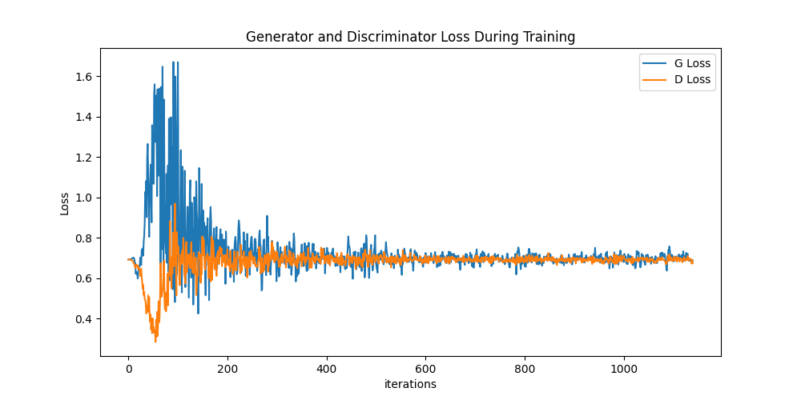
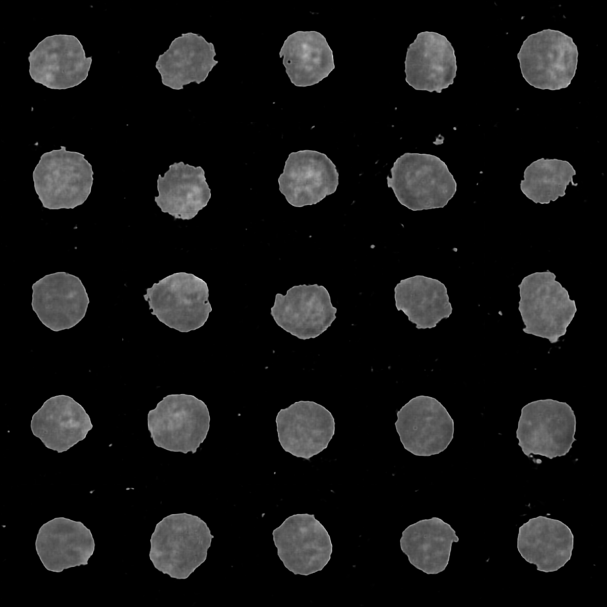

# Retinal Image-Based Acute Lymphocytic Leukemia Diagnosis Using Deep Learning and GANs

## Introduction
Acute Lymphoblastic Leukemia (ALL) is a common cancer in children, comprising about 30% of all pediatric cancers. Early diagnosis is crucial for effective treatment and significantly increases survival rates. This project explores the application of image processing techniques and Generative Adversarial Networks (GANs) to diagnose ALL from retinal images obtained through microscopic examination.

## Objectives
- Develop a diagnostic model for ALL using image processing techniques and GANs.
- Enhance the model's performance through data augmentation techniques.
- Compare the performance of different models.
- Evaluate the model's effectiveness in diagnosing ALL.

## Research Methods
The study focuses on differentiating between normal and ALL-infected white blood cells using retinal images. We employ various deep learning models and augment data with synthetic images generated by GANs to balance the dataset.

### Dataset Preparation
Data augmentation includes Gaussian blur to simulate low-quality imaging conditions and synthetic data generation using DCGANs.

#### Sample

### Model Training
Three deep learning models are explored:
- EfficientNet-B3
- MaxVit
- ViT

Models are adjusted for the specific data characteristics and tuned for optimal performance with appropriate optimizers and learning rates.

### Performance Evaluation
Model performance is evaluated using loss graphs and classification metrics (AUC, Precision, Recall, F1-score). We also assess the impact of GAN-augmented data on model efficacy.

## Results
Results indicate significant improvements in model performance with GANs, especially in data classification accuracy and reliability of synthetic data generation. Detailed performance metrics are provided for each model, pre and post GANs augmentation.

## Conclusion
The integration of image processing and GANs shows promising results in enhancing the diagnostic accuracy of ALL. Future work will focus on refining these techniques and expanding the dataset for broader applicability.

## License
This project is licensed under the [MIT License](LICENSE).

## Acknowledgments
We would like to acknowledge and thank the open-source community for their contributions to the libraries and tools used in this project. Additionally, we appreciate the support of medical professionals in making this project possible.
